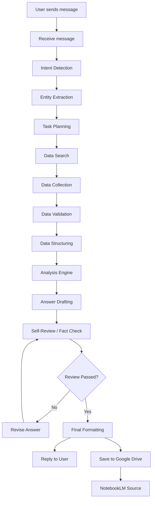

# Stock Scanner Bot

LINE chatbot / web chatbot for scanning stocks from Thai, English, and mixed-language user messages. The bot detects intent, resolves tickers or company names, fetches market data and news, calculates technical indicators, summarizes fundamentals and risks, scores the stock, and returns a structured educational analysis.

Every response includes a disclaimer. The bot does not provide guaranteed financial advice.

## Cloud Architecture

```text
LINE OA -> Google Cloud Run -> Bot backend -> Google Drive -> NotebookLM
                         |
                         +-> Cloud Scheduler -> POST /daily-report
```

Google Drive is only file storage. The bot runtime is Google Cloud Run, so your personal computer does not need to stay on.

## Features

- LINE Messaging API webhook at `/line/webhook`
- Cloud Run LINE webhook at `/webhook`
- Daily scheduled report endpoint at `/daily-report`
- Natural-language intent detection for Thai / English / mixed messages
- Ticker, company name, and sector resolution
- Stock detail scan
- Technical analysis scan
- News scan
- Fundamental analysis scan
- Peer comparison
- Sector scan
- User watchlist
- Price alert storage
- SQLite database by default
- LINE-safe long-message splitting
- Optional image card generator module
- Google Drive service-account upload for generated PDF, Markdown, and CSV reports
- NotebookLM-optimized Markdown daily report source

## Project Structure

```text
stock-scanner-bot/
  README.md
  requirements.txt
  .env.example
  main.py
  config.py

  src/
    line_webhook.py
    intent_parser.py
    ticker_resolver.py
    stock_data.py
    news_collector.py
    technical_analysis.py
    fundamental_analysis.py
    sentiment_analysis.py
    stock_scorer.py
    watchlist_manager.py
    alert_manager.py
    response_generator.py
    image_card_generator.py
    database.py

  tests/
    test_intent_parser.py
    test_ticker_resolver.py
    test_technical_analysis.py
    test_response_generator.py
```

## Cloud Run Endpoints

```text
GET  /health
POST /webhook
POST /line/webhook
POST /daily-report
```

Use `/webhook` for LINE OA. `/line/webhook` is kept as a backward-compatible alias.

## Agentic Workflow Pipeline

Every user message now passes through a modular workflow before the bot replies:

```text
Receive message
-> Detect intent
-> Extract entities
-> Create task plan
-> Search sources
-> Collect data
-> Validate data
-> Structure data
-> Analyze data
-> Draft answer
-> Self-review / fact-check
-> Revise if needed
-> Format final response
-> Reply to user
-> Save NotebookLM-ready Markdown to Google Drive when configured
```

Mermaid view:



Pipeline modules:

```text
src/message_receiver.py
src/intent_parser.py
src/entity_extractor.py
src/task_planner.py
src/data_searcher.py
src/data_collector.py
src/data_validator.py
src/data_structurer.py
src/analysis_engine.py
src/answer_reviewer.py
src/final_formatter.py
src/notebooklm_formatter.py
src/google_drive_storage.py
src/agentic_workflow.py
```

`answer_reviewer.py` checks whether the answer includes risks, avoids overconfident investment language, and includes a disclaimer. If the review fails, the workflow revises the answer before sending it.

## Install

```powershell
cd "C:\Users\Chanasorn T\OneDrive\เอกสาร\Money\stock-scanner-bot"
python -m venv .venv
.\.venv\Scripts\Activate.ps1
pip install -r requirements.txt
copy .env.example .env
```

On this machine, if `python` is not on PATH, use the bundled interpreter:

```powershell
& "C:\Users\Chanasorn T\.cache\codex-runtimes\codex-primary-runtime\dependencies\python\python.exe" main.py
```

## Environment Variables

```env
FINNHUB_API_KEY=
ALPHA_VANTAGE_API_KEY=
POLYGON_API_KEY=
NEWS_API_KEY=
LINE_CHANNEL_ACCESS_TOKEN=
LINE_CHANNEL_SECRET=
DATABASE_URL=sqlite:///data/stock_scanner.db
OPENAI_API_KEY=
GOOGLE_DRIVE_FOLDER_ID=
GOOGLE_APPLICATION_CREDENTIALS_JSON=
GOOGLE_SERVICE_ACCOUNT_FILE=
DAILY_REPORT_TOKEN=
DAILY_REPORT_TICKERS=NVDA,MSFT,AAPL,GOOGL,AMZN,META,TSLA,AVGO,AMD,COST,JPM,LLY
NOTEBOOKLM_SOURCE_PREFIX=NotebookLM_Source_Global_Stock_Briefing
PDF_REPORT_PREFIX=Global_Stock_Briefing
CSV_REPORT_PREFIX=Global_Stock_Briefing_Data
APP_HOST=0.0.0.0
APP_PORT=8000
DEFAULT_LANGUAGE=th
MAX_NEWS_ITEMS=5
PRICE_HISTORY_PERIOD=1y
```

The current implementation works with Yahoo Finance via `yfinance` and RSS feeds. Finnhub, Alpha Vantage, Polygon, NewsAPI, and OpenAI keys are reserved for extending data quality and AI summarization.

## Google Drive Service Account Setup

1. In Google Cloud Console, enable Google Drive API.
2. Create a service account.
3. Create a JSON key for that service account.
4. Open the target Google Drive folder.
5. Share that folder with the service account email, such as:

```text
stock-bot-uploader@your-project.iam.gserviceaccount.com
```

6. Copy the Drive folder ID from the folder URL:

```text
https://drive.google.com/drive/folders/FOLDER_ID_HERE
```

7. Set environment variables in Cloud Run:

```env
GOOGLE_DRIVE_FOLDER_ID=FOLDER_ID_HERE
GOOGLE_APPLICATION_CREDENTIALS_JSON={"type":"service_account",...}
```

Alternative:

```env
GOOGLE_SERVICE_ACCOUNT_FILE=/secrets/service-account.json
```

For Cloud Run, `GOOGLE_APPLICATION_CREDENTIALS_JSON` is usually the simplest route. Store it as a Secret Manager secret when possible, then mount it as an environment variable.

## Set Up LINE Messaging API

1. Open [LINE Developers Console](https://developers.line.biz/console/).
2. Select your provider and Messaging API channel.
3. Copy `Channel access token` into:

```env
LINE_CHANNEL_ACCESS_TOKEN=
```

4. Copy `Channel secret` into:

```env
LINE_CHANNEL_SECRET=
```

5. Deploy this app to an HTTPS URL.
6. Set webhook URL after Cloud Run deploy:

```text
https://YOUR-CLOUD-RUN-URL/webhook
```

7. Enable `Use webhook`.
8. Send a test message such as `NVDA`.

## Run Locally

```powershell
python main.py
```

Health check:

```text
http://localhost:8000/health
```

For LINE local webhook testing, expose your local server:

```powershell
ngrok http 8000
```

Then use:

```text
https://your-ngrok-domain.ngrok-free.app/line/webhook
```

## Deploy

This project is configured for Google Cloud Run with `Dockerfile`.

### Deploy To Google Cloud Run

Set variables:

```bash
export PROJECT_ID="your-gcp-project-id"
export REGION="asia-southeast1"
export SERVICE_NAME="stock-scanner-bot"
```

Enable required APIs:

```bash
gcloud services enable run.googleapis.com
gcloud services enable cloudbuild.googleapis.com
gcloud services enable drive.googleapis.com
gcloud services enable cloudscheduler.googleapis.com
```

Deploy from the `stock-scanner-bot` directory:

```bash
cd stock-scanner-bot
gcloud run deploy "$SERVICE_NAME" \
  --source . \
  --region "$REGION" \
  --allow-unauthenticated \
  --set-env-vars DEFAULT_LANGUAGE=th,MAX_NEWS_ITEMS=5,PRICE_HISTORY_PERIOD=1y,DATABASE_URL=sqlite:////tmp/stock_scanner.db,GOOGLE_DRIVE_FOLDER_ID=YOUR_FOLDER_ID,DAILY_REPORT_TICKERS=NVDA,MSFT,AAPL,GOOGL,AMZN,META,TSLA,AVGO,AMD,COST,JPM,LLY \
  --set-secrets LINE_CHANNEL_ACCESS_TOKEN=LINE_CHANNEL_ACCESS_TOKEN:latest,LINE_CHANNEL_SECRET=LINE_CHANNEL_SECRET:latest,GOOGLE_APPLICATION_CREDENTIALS_JSON=GOOGLE_APPLICATION_CREDENTIALS_JSON:latest,DAILY_REPORT_TOKEN=DAILY_REPORT_TOKEN:latest
```

Notes:

- `--allow-unauthenticated` is needed because LINE must reach `/webhook`.
- Keep `DAILY_REPORT_TOKEN` secret. Cloud Scheduler sends it to `/daily-report`.
- For durable user watchlists, replace SQLite with Cloud SQL or Firestore later. SQLite in `/tmp` is ephemeral on Cloud Run.

Get service URL:

```bash
gcloud run services describe "$SERVICE_NAME" \
  --region "$REGION" \
  --format "value(status.url)"
```

Set LINE webhook:

```text
https://YOUR-CLOUD-RUN-URL/webhook
```

### Cloud Scheduler Daily Report

Create a scheduler service account:

```bash
gcloud iam service-accounts create stock-report-scheduler \
  --display-name "Stock report scheduler"
```

Grant Cloud Run invoker:

```bash
gcloud run services add-iam-policy-binding "$SERVICE_NAME" \
  --region "$REGION" \
  --member "serviceAccount:stock-report-scheduler@$PROJECT_ID.iam.gserviceaccount.com" \
  --role "roles/run.invoker"
```

Create a daily 7 AM Bangkok job:

```bash
SERVICE_URL="$(gcloud run services describe "$SERVICE_NAME" --region "$REGION" --format 'value(status.url)')"

gcloud scheduler jobs create http daily-stock-report \
  --location "$REGION" \
  --schedule "0 7 * * *" \
  --time-zone "Asia/Bangkok" \
  --uri "$SERVICE_URL/daily-report" \
  --http-method POST \
  --headers "Content-Type=application/json,X-Daily-Report-Token=YOUR_DAILY_REPORT_TOKEN" \
  --message-body "{}" \
  --oidc-service-account-email "stock-report-scheduler@$PROJECT_ID.iam.gserviceaccount.com"
```

The `/daily-report` endpoint generates:

```text
Global_Stock_Briefing_YYYY-MM-DD.pdf
NotebookLM_Source_Global_Stock_Briefing_YYYY-MM-DD.md
Global_Stock_Briefing_Data_YYYY-MM-DD.csv
```

It uploads all three files to Google Drive. The Markdown is structured for NotebookLM with ticker-level headings, sector labels, source IDs, and a final source index.

## Supported Messages

```text
NVDA
วิเคราะห์ Tesla ให้หน่อย
ขอแนวรับแนวต้าน AAPL
หุ้น AI ตัวไหนน่าสนใจวันนี้
สแกนหุ้นกลุ่ม semiconductor
เทียบ AVGO กับ NVDA
ขอข่าว PLTR วันนี้
เพิ่ม NVDA เข้า watchlist
ลบ TSLA
สรุป watchlist
แจ้งเตือนถ้า NVDA ลงถึง 120
```

## Intents

- `stock_detail_scan`
- `technical_analysis`
- `news_scan`
- `fundamental_analysis`
- `peer_comparison`
- `sector_scan`
- `watchlist_add`
- `watchlist_remove`
- `watchlist_summary`
- `price_alert`

## Stock Scoring

Overall score uses:

```text
Fundamental score: 35%
Technical score: 30%
News sentiment score: 20%
Valuation score: 10%
Risk score: 5%
```

Labels:

```text
80-100 = Strong candidate
65-79 = Good but wait for price
50-64 = Neutral / Watch
35-49 = Weak
0-34 = Avoid
```

Customize scoring in:

[src/stock_scorer.py](<src/stock_scorer.py>)

## Add More Data Sources

Extend:

- [src/stock_data.py](<src/stock_data.py>) for market data APIs
- [src/news_collector.py](<src/news_collector.py>) for news APIs and investor relations pages
- [src/fundamental_analysis.py](<src/fundamental_analysis.py>) for SEC filings or financial statements
- [src/sentiment_analysis.py](<src/sentiment_analysis.py>) for AI sentiment models

## Connect With Google Drive And NotebookLM Later

This bot is designed to complement the existing daily briefing system. Later extensions can:

- Save each scan as Markdown
- Upload scan summaries to Google Drive
- Build NotebookLM source packets by ticker or sector
- Append ticker scans to daily NotebookLM source files

The NotebookLM source formatter already exists in the sibling `stock-briefing-agent` project and can be reused.

## Error Handling

The bot handles:

- Invalid ticker
- Company name not found
- Missing API keys
- Data source unavailable
- No recent news
- Long LINE response splitting
- Invalid LINE signature

Fallback response:

```text
ยังไม่เจอข้อมูลหุ้นตัวนี้ครับ ลองส่งเป็น ticker เช่น NVDA, AAPL, TSLA หรือ MSFT อีกครั้งได้เลยครับ
```

## Safety

Every analysis must include:

```text
หมายเหตุ: ข้อมูลนี้ใช้เพื่อการศึกษาและช่วยประกอบการตัดสินใจเท่านั้น ไม่ใช่คำแนะนำการลงทุนแบบรับประกันผลตอบแทน ผู้ลงทุนควรศึกษาข้อมูลเพิ่มเติมและบริหารความเสี่ยงด้วยตนเอง
```
